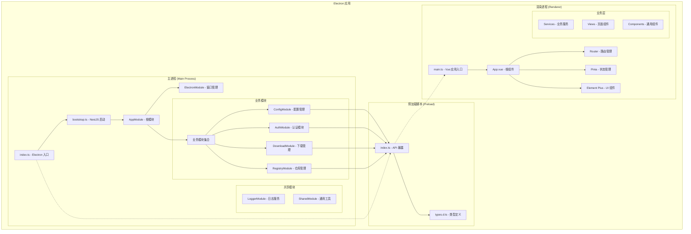

# 设计文档

## 概述

本设计文档描述了将现有 electron-vite 模板项目升级为基于 Electron + NestJS + Vue 3 + Element Plus 现代化架构的详细设计方案。设计重点关注模块化架构、类型安全的 IPC 通信和可扩展的项目结构。

## 实施策略

### 渐进式开发原则

本项目采用渐进式开发策略，避免一次性引入过多复杂性：

1. **最小可行架构优先**: 首先建立最基础的架构框架，确保核心通信机制正常工作
2. **功能简化实现**: 每个模块先实现最简单的版本，验证架构可行性
3. **逐步增强特性**: 在基础功能稳定后，再逐步添加高级特性和优化
4. **分阶段验证**: 每个阶段完成后进行充分测试，确保稳定性后再进入下一阶段

### 实施阶段划分

#### 第一阶段：基础架构搭建
- 核心依赖安装和配置
- NestJS 微服务基础框架
- 最简单的 IPC 通信验证
- Vue 3 + Element Plus 基础界面

#### 第二阶段：核心模块简化实现
- 基础的模块结构搭建
- 简化的业务逻辑实现
- 基本的错误处理机制

#### 第三阶段：功能完善和优化
- 完整的业务功能实现
- 性能优化和用户体验提升
- 高级特性和扩展功能

这种渐进式方法确保每一步都是可控的，降低了技术风险，同时便于问题定位和解决。

## 架构设计

### 整体架构图



### 技术栈选择

#### 主进程技术栈
- **NestJS 11.x**: 企业级 Node.js 框架，提供依赖注入和模块化架构
- **@doubleshot/nest-electron 0.2.8**: NestJS 与 Electron 的集成解决方案
- **@nestjs/microservices**: 微服务支持，用于 IPC 传输
- **electron-log**: 统一日志管理
- **reflect-metadata**: 装饰器元数据支持

#### 渲染进程技术栈
- **Vue 3.5.x**: 现代化前端框架，使用 Composition API
- **Element Plus**: 企业级 Vue 3 UI 组件库
- **Pinia**: Vue 3 官方状态管理库
- **Vue Router 4**: 单页应用路由管理
- **TypeScript 5.8.x**: 类型安全支持

#### 构建和开发工具
- **electron-vite 4.x**: Electron 应用构建工具
- **Vite 7.x**: 快速构建工具
- **pnpm**: 高效包管理器
- **ESLint + Prettier**: 代码质量和格式化

## 组件和接口设计

### 主进程架构设计

#### 1. 应用启动流程

```typescript
// src/main/bootstrap.ts
export async function bootstrap() {
  await app.whenReady()
  
  // 配置日志系统
  configureLogger()
  
  // 创建 NestJS 微服务
  const nestApp = await NestFactory.createMicroservice<MicroserviceOptions>(
    AppModule,
    { strategy: new ElectronIpcTransport() }
  )
  
  await nestApp.listen()
  return nestApp
}
```

#### 2. 模块结构设计

```typescript
// src/main/app.module.ts
@Module({
  imports: [
    ConfigModule.forRoot({ isGlobal: true }),
    EventEmitterModule.forRoot(),
    ElectronModule.registerAsync({
      useFactory: createMainWindow
    }),
    LoggerModule,
    RegistryModule,
    DownloadModule,
    AuthModule,
    ConfigurationModule
  ]
})
export class AppModule {}
```

#### 3. IPC 控制器设计

```typescript
// 控制器基础结构
@Controller('module-name')
export class ModuleController {
  @IpcHandle('method-name')
  async handleMethod(@Payload() data: DTO, @Ctx() context: IpcContext) {
    // 处理逻辑
  }
  
  @IpcOn('event-name')
  handleEvent(@Payload() data: DTO) {
    // 事件处理
  }
}
```

### IPC 通信设计

#### 1. 通信协议设计

```typescript
// IPC 通道命名规范: 'module/method'
interface IpcChannels {
  'registry/search-images': (query: SearchQuery) => Promise<ImageInfo[]>
  'registry/get-tags': (imageName: string) => Promise<TagInfo[]>
  'download/start': (request: DownloadRequest) => Promise<DownloadTask>
  'download/pause': (taskId: string) => Promise<void>
}
```

#### 2. Preload 脚本设计

```typescript
// src/preload/index.ts
const api = {
  registry: {
    searchImages: (query: SearchQuery) => 
      ipcRenderer.invoke('registry/search-images', query),
    getTags: (imageName: string) => 
      ipcRenderer.invoke('registry/get-tags', imageName)
  },
  download: {
    start: (request: DownloadRequest) => 
      ipcRenderer.invoke('download/start', request),
    onProgress: (callback: ProgressCallback) => 
      ipcRenderer.on('download/progress', callback)
  }
}

contextBridge.exposeInMainWorld('api', api)
```

### 前端架构设计

#### 1. Vue 应用结构

```typescript
// src/renderer/src/main.ts
const app = createApp(App)
app.use(createPinia())
app.use(router)
app.use(ElementPlus)
app.mount('#app')
```

#### 2. 状态管理设计

```typescript
// Pinia Store 结构
export const useRegistryStore = defineStore('registry', () => {
  const images = ref<ImageInfo[]>([])
  const loading = ref(false)
  
  const searchImages = async (query: SearchQuery) => {
    loading.value = true
    try {
      images.value = await window.api.registry.searchImages(query)
    } finally {
      loading.value = false
    }
  }
  
  return { images, loading, searchImages }
})
```

#### 3. 路由设计

```typescript
// 路由结构
const routes = [
  { path: '/', component: Dashboard },
  { path: '/registry', component: RegistryManagement },
  { path: '/downloads', component: DownloadManager },
  { path: '/settings', component: Settings }
]
```

## 数据模型

### 核心数据传输对象

```typescript
// 镜像搜索查询
interface SearchQuery {
  keyword: string
  registry?: string
  limit?: number
  offset?: number
}

// 镜像信息
interface ImageInfo {
  name: string
  description?: string
  stars: number
  pulls: number
  tags: string[]
  architectures: string[]
}

// 下载请求
interface DownloadRequest {
  imageName: string
  tag: string
  architecture: string
  outputPath: string
}

// 下载任务
interface DownloadTask {
  id: string
  imageName: string
  tag: string
  status: 'pending' | 'downloading' | 'completed' | 'failed'
  progress: number
  speed?: string
  eta?: string
}
```

### 配置数据模型

```typescript
// 应用配置
interface AppConfig {
  theme: 'light' | 'dark' | 'auto'
  language: string
  downloadPath: string
  maxConcurrentDownloads: number
}

// 仓库配置
interface RegistryConfig {
  id: string
  name: string
  url: string
  type: 'docker-hub' | 'private'
  auth?: {
    username: string
    password: string
  }
}
```

## 错误处理

### 错误分类和处理策略

```typescript
// 自定义错误类型
export class RegistryError extends Error {
  constructor(message: string, public code: string) {
    super(message)
  }
}

export class DownloadError extends Error {
  constructor(message: string, public taskId: string) {
    super(message)
  }
}

// 全局错误处理器
@Catch()
export class GlobalExceptionFilter implements ExceptionFilter {
  catch(exception: any, host: ArgumentsHost) {
    const ctx = host.switchToRpc()
    const error = {
      message: exception.message,
      code: exception.code || 'UNKNOWN_ERROR',
      timestamp: new Date().toISOString()
    }
    
    // 记录错误日志
    logger.error('IPC Error:', error)
    
    // 返回用户友好的错误信息
    return { success: false, error }
  }
}
```

### 前端错误处理

```typescript
// 全局错误处理
app.config.errorHandler = (err, vm, info) => {
  console.error('Vue Error:', err, info)
  ElMessage.error('应用发生错误，请重试')
}

// API 调用错误处理
const handleApiError = (error: any) => {
  if (error.code === 'NETWORK_ERROR') {
    ElMessage.error('网络连接失败')
  } else if (error.code === 'AUTH_ERROR') {
    ElMessage.error('认证失败，请检查凭据')
  } else {
    ElMessage.error(error.message || '操作失败')
  }
}
```

## 测试策略

### 单元测试设计

```typescript
// 主进程服务测试
describe('RegistryService', () => {
  let service: RegistryService
  
  beforeEach(async () => {
    const module = await Test.createTestingModule({
      providers: [RegistryService]
    }).compile()
    
    service = module.get<RegistryService>(RegistryService)
  })
  
  it('should search images successfully', async () => {
    const result = await service.searchImages({ keyword: 'nginx' })
    expect(result).toBeDefined()
    expect(Array.isArray(result)).toBe(true)
  })
})
```

### 集成测试设计

```typescript
// IPC 通信集成测试
describe('IPC Communication', () => {
  let app: INestMicroservice
  
  beforeAll(async () => {
    app = await NestFactory.createMicroservice(AppModule, {
      strategy: new ElectronIpcTransport()
    })
    await app.listen()
  })
  
  it('should handle registry search request', async () => {
    const result = await app.get(RegistryController)
      .searchImages({ keyword: 'test' })
    expect(result).toBeDefined()
  })
})
```

## 性能优化

### 主进程优化策略

1. **懒加载模块**: 按需加载业务模块，减少启动时间
2. **连接池管理**: 复用 HTTP 连接，提高网络请求效率
3. **缓存策略**: 缓存频繁访问的数据，减少重复计算
4. **异步处理**: 使用事件驱动架构处理长时间运行的任务

### 渲染进程优化策略

1. **虚拟滚动**: 大量数据列表使用虚拟滚动组件
2. **组件懒加载**: 路由级别的组件懒加载
3. **状态管理优化**: 合理设计 Pinia store 结构，避免不必要的响应式更新
4. **图片懒加载**: 镜像图标和截图使用懒加载

### 构建优化

1. **代码分割**: 按路由和功能模块进行代码分割
2. **Tree Shaking**: 移除未使用的代码
3. **资源压缩**: 压缩 JavaScript、CSS 和图片资源
4. **缓存策略**: 合理设置构建缓存，提高构建速度

## 安全考虑

### IPC 通信安全

1. **输入验证**: 所有 IPC 输入使用 DTO 进行验证
2. **权限控制**: 限制渲染进程可访问的 API
3. **上下文隔离**: 启用 contextIsolation 和禁用 nodeIntegration
4. **CSP 策略**: 配置内容安全策略防止 XSS 攻击

### 数据安全

1. **敏感信息过滤**: 日志记录时过滤敏感信息
2. **错误信息脱敏**: 生产环境不暴露详细错误信息
3. **输入清理**: 清理和验证所有用户输入
4. **安全传输**: 使用 HTTPS 进行网络通信

## 部署和维护

### 开发环境配置

1. **环境变量管理**: 使用 .env 文件管理环境配置
2. **热重载支持**: 开发环境支持主进程和渲染进程热重载
3. **调试工具**: 集成 Vue DevTools 和 Chrome DevTools
4. **代码质量检查**: 集成 ESLint、Prettier 和 TypeScript 检查

### 构建和打包

1. **多平台构建**: 支持 Windows、macOS 和 Linux 平台
2. **自动化构建**: 使用 CI/CD 流水线自动构建和测试
3. **版本管理**: 语义化版本控制和变更日志
4. **分发策略**: 支持自动更新和手动分发

### 监控和日志

1. **结构化日志**: 使用结构化格式记录日志
2. **日志轮转**: 自动轮转和清理历史日志
3. **性能监控**: 监控应用性能和资源使用
4. **错误追踪**: 收集和分析错误信息